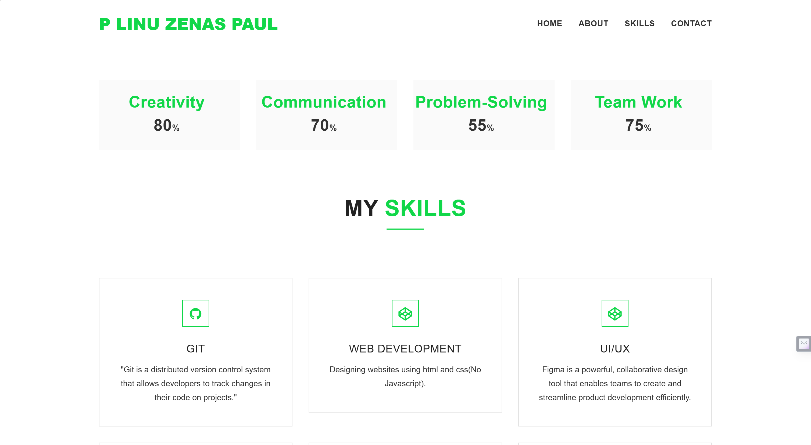
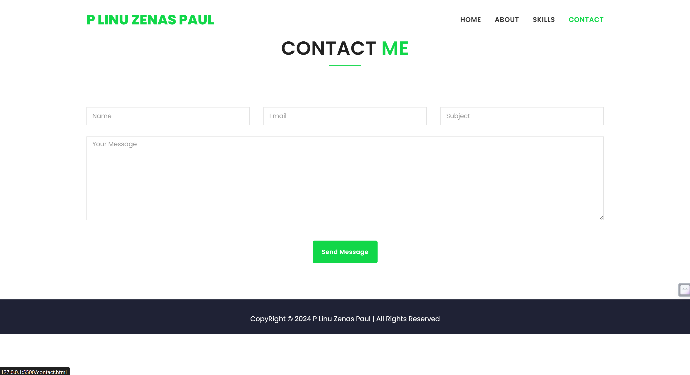

# My Portfolio

Welcome to my portfolio! This project showcases my skills in **HTML**, **CSS**, and **JavaScript**. It is a responsive and interactive website that highlights my projects, skills, and contact information.

## Features

- **Responsive Design**: The portfolio is fully responsive and works seamlessly on all devices.
- **Interactive Elements**: Built with JavaScript to provide a dynamic user experience.
- **Modern Styling**: Utilizes CSS Flexbox, Grid, and animations for a modern look.
- **Project Showcase**: A dedicated section to display my projects with links to live demos and GitHub repositories.

## Technologies Used

- **HTML5**: For structuring the content.
- **CSS3**: For styling and animations.
- **JavaScript**: For interactivity and dynamic content.

## Setup Instructions

1. **Clone the repository**:
   ```bash
   git clone https://github.com/your-username/Portfolio.git
2. **Navigate to project directory**:
   ```bash
   cd Portfolio
3. **Open the project**:
    - Open the index.html file in your browser to view the portfolio.

## 🖥️ Preview

### **Homepage**


### **About**


### **Skills**


### **Contact Page**


# License

Open the index.html file in your browser to view the portfolio.
